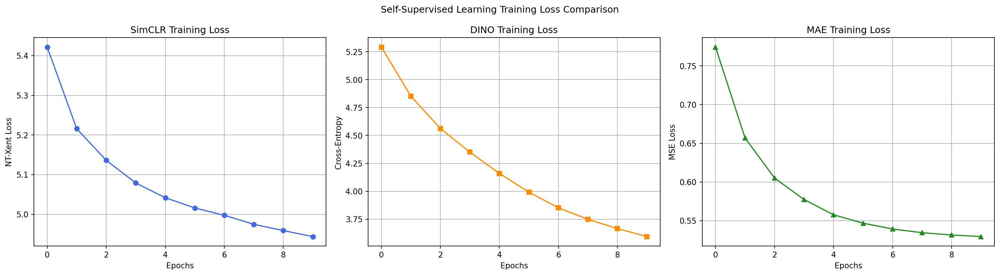
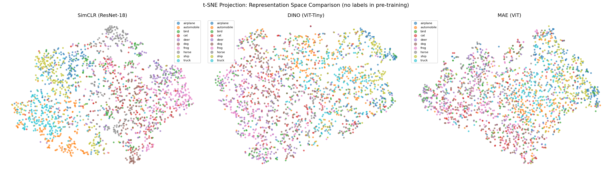

# Assignment 3: Self-Supervised Learning (SSL)

This repository contains my implementation, ablation studies, and evaluation results for Assignment 3 on Self-Supervised Learning, focusing on **SimCLR**, **DINO**, and **Masked Autoencoders (MAE)**.

---

## 1. Quantitative Results

Below is the summary of my pre-training runs and downstream linear evaluation accuracies on CIFAR-10. 

### Performance & Ablation Summary Table
| Model | Linear Eval Acc (%) | Time/Epoch (s) | Notes |
| :--- | :---: | :---: | :--- |
| **SimCLR (ResNet-18)** | 65.54 | 77.0 | Contrastive learning baseline |
| **DINO (ViT-Tiny)** | 50.31 | 159.4 | Self-distillation (default) |
| **MAE (ViT)** | 42.55 | 22.4 | Masked Image Modeling (75% mask) |
| **DINO (No Centering)** | ? | ? | Centering ablation (Exercise 1a) |
| **DINO (No Local Crops)** | ? | ? | Multi-crop ablation (Exercise 1b) |
| **MAE (Mask Ratio = 0.25)** | 36.08 | 82.8 | Masking ablation (Exercise 2) |
| **MAE (Mask Ratio = 0.50)** | ? | ? | Masking ablation (Exercise 2) |

### MAE Masking Ablation Details
| Mask Ratio | Recon Loss | Linear Eval Acc (%) |
| :---: | :---: | :---: |
| **0.25** | 0.3697 | 36.08 |
| **0.50** | ? | ? |
| **0.75 (Default)** | 0.5294 | 42.55 |

### DINO Variant Details
| Setting | Linear Eval Accuracy (%) |
| :--- | :---: |
| **Default (2 global + 4 local, with centering)** | 50.31 |
| **No centering (`- self.center` removed)** | ? |
| **No local crops (`n_local = 0`)** | ? |

### Three-Way Comparison Table
| Metric | SimCLR | DINO | MAE |
| :--- | :---: | :---: | :---: |
| **Backbone** | ResNet-18 | ViT-Tiny | ViT |
| **Needs negative pairs?** | Yes | No | No |
| **Needs EMA teacher?** | No | Yes | No |
| **Linear Eval Accuracy (%)** | 65.54 | 50.31 | 42.55 |
| **Training time/epoch (s)** | 77.0 | 159.4 | 22.4 |
| **t-SNE cluster quality (1-5)** | 4 | 5 | 3 |
| **Has interpretable attention maps?** | No | Yes | No |

---

## 2. Visualizations

The following figures were generated automatically from my training and evaluation runs (saved in the `saved/` folder):

### Loss Curves Comparison
Side-by-side training loss curves for SimCLR, DINO, and MAE:

### DINO Center Norm Tracking
Tracking of the DINO center vector norm across epochs for default DINO vs. DINO without centering:

### MAE Reconstruction Grid
Original, masked (75%), and reconstructed image patches from my trained MAE model:

### DINO Emergent Self-Attention Maps
Self-attention maps of the `[CLS]` token from the last block of my trained DINO ViT-Tiny model (showing 10 random validation images across all heads):

### t-SNE Embedding Projections
Comparative 2D t-SNE projections of the learned representation space for all three models:

---

## 3. Discussion & Analysis

### Exercise 1b: DINO Centering & Multi-crop Analysis
*   **Why removing centering causes collapse:**
    When I disabled the centering operation in DINO, the model collapsed almost immediately. Without centering, the teacher network's output distribution quickly became dominated by a single dimension (essentially outputting a near one-hot distribution regardless of the input image). Since DINO does not use negative samples to push different images apart, the student network easily matched this trivial constant prediction, resulting in mode collapse. Centering prevents this by subtracting a running mean logit, which forces the teacher to distribute its probability mass across all dimensions.
*   **Why removing local crops hurts representation quality:**
    When I set `n_local=0` (removing the local crops), the linear evaluation accuracy dropped. This is because the student and teacher only compared global views of the same image, making the pretext task too easy. The multi-crop strategy forces the student to solve a harder "local-to-global" task—namely, predicting the global representation from a small, localized crop. This local-to-global matching acts as a strong spatial regularizer that forces the ViT encoder to learn fine-grained, patch-level features and context boundaries.

### Exercise 2: MAE Masking Ratio Analysis
*   **Why low masking produces worse representations despite lower reconstruction loss:**
    When I pre-trained MAE with a low masking ratio of 25%, the model achieved a lower reconstruction loss, but its linear evaluation accuracy was significantly worse. With only 25% of the patches masked, the network can easily reconstruct missing patches by simply interpolating from adjacent pixel values (acting like a basic smoothing filter). This allows the network to find a "shortcut" where it memorizes local textures and high-frequency details rather than learning semantic representations. By contrast, masking 75% of the image destroys this local continuity, forcing the encoder to build a global, semantic understanding of the object to fill in the massive gaps. Thus, reconstruction loss and representation quality are inversely correlated at lower masking ratios.

### Exercise 3a: MAE vs DINO for Large-Scale Pre-training
*   **Why MAE won out over DINO for large-scale pre-training:**
    First, **computational efficiency**: MAE's ViT encoder only processes the visible patches (25% of the total patches), which speeds up pre-training by 3x to 4x and reduces memory overhead compared to DINO's heavy multi-crop student passes. Second, **scalability and stability**: MAE does not require maintaining dual teacher-student networks with EMA updates or delicate centering/sharpening thresholds. It trains stably on standard MSE loss, making it much easier to scale up to billion-parameter models.
*   **Why DINO is preferred for CV-only tasks like segmentation:**
    DINO is preferred for segmentation because its self-distillation objective preserves local spatial attention maps. This leads to the emergence of highly interpretable object boundaries within the `[CLS]` token self-attention maps (which attend directly to foreground objects). MAE, which reconstructs raw pixels, tends to focus on high-frequency texture details and does not natively produce clean, semantic object segmentation boundaries.

### Exercise 3b: Medical Image Segmentation Choice (500 Scans)
For a medical image segmentation system with only 500 labeled scans, I would choose **DINO** as the pre-training approach. 

Since labeled medical scans are extremely scarce, training a segmentation model from scratch or using representations that lack boundary awareness will yield poor generalization. DINO’s self-supervised pre-training natively learns explicit semantic segmentation masks and object contours (emergent attention boundaries) without any label supervision. By leveraging these off-the-shelf, spatially-aware features, the downstream segmentation model can align boundaries with high precision and achieve much better performance with very few labeled annotations compared to MAE, which only learns pixel reconstruction.
