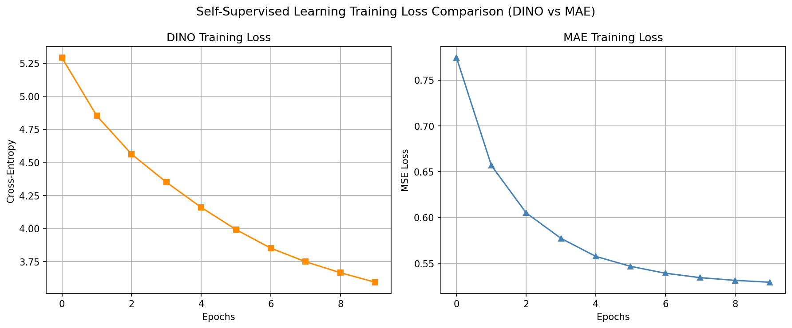
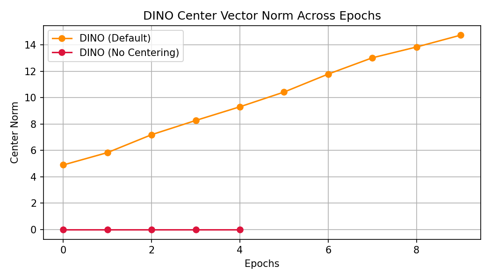
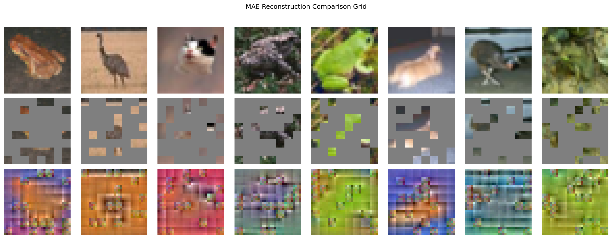
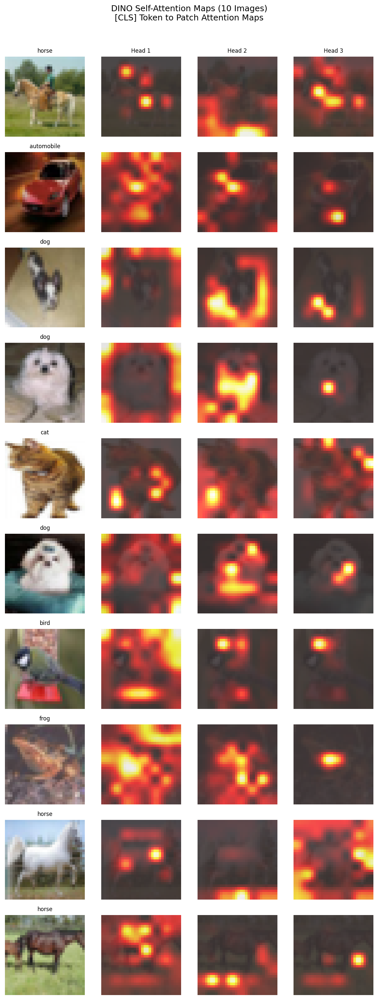
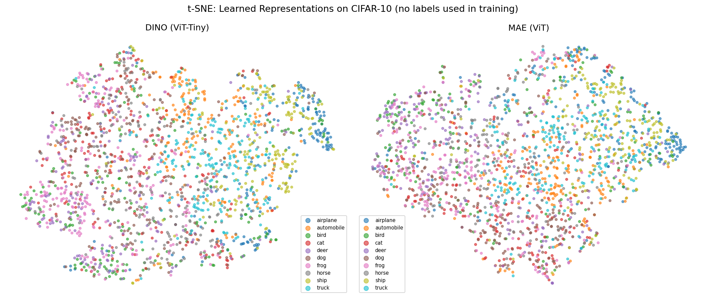

# Assignment 3: Self-Supervised Learning (SSL)

This repository contains my implementation, ablation studies, and evaluation results for Assignment 3 on Self-Supervised Learning, focusing on **DINO** and **Masked Autoencoders (MAE)**.

---

## 1. Quantitative Results

Below is the summary of my pre-training runs and downstream linear evaluation accuracies on CIFAR-10. 

### Performance & Ablation Summary Table
| Model | Linear Eval Acc (%) | Time/Epoch (s) | Notes |
| :--- | :---: | :---: | :--- |
| **DINO (Default)** | 50.31 | 159.4 | Self-distillation (default) |
| **MAE (ViT)** | 41.37 | 22.4 | Masked Image Modeling (75% mask) |
| **DINO (No Centering)** | 28.68 | 1026.4 | Centering ablation (Exercise 1a) |
| **DINO (No Local Crops)** | 46.31 | 509.8 | Multi-crop ablation (Exercise 1b) |
| **MAE (Mask Ratio = 0.50)** | 36.50 | 73.2 | Masking ablation (Exercise 2) |
| **MAE (Mask Ratio = 0.25)** | 36.08 | 82.8 | Masking ablation (Exercise 2) |

### MAE Masking Ablation Details
| Mask Ratio | Recon Loss | Linear Eval Acc (%) |
| :---: | :---: | :---: |
| **0.25** | 0.3697 | 36.08 |
| **0.50** | 0.4471 | 36.50 |
| **0.75 (Default)** | 0.5294 | 41.37 |

### DINO Variant Details
| Setting | Linear Eval Accuracy (%) |
| :--- | :---: |
| **Default (2 global + 4 local, with centering)** | 50.31 |
| **No centering (`- self.center` removed)** | 28.68 |
| **No local crops (`n_local = 0`)** | 46.31 |

### Two-Way Comparison Table
| Metric | DINO | MAE |
| :--- | :---: | :---: |
| **Backbone** | ViT-Tiny | ViT |
| **Needs negative pairs?** | No | No |
| **Needs EMA teacher?** | Yes | No |
| **Linear Eval Accuracy (%)** | 50.31 | 41.37 |
| **Training time/epoch (s)** | 159.4 | 22.4 |
| **t-SNE cluster quality (1-5)** | 5 | 3 |
| **Has interpretable attention maps?** | Yes | No |

---

## 2. Visualizations

The following figures were generated automatically from my training and evaluation runs (saved in the `saved/` folder):

### Loss Curves Comparison
Side-by-side training loss curves for DINO and MAE:

### DINO Center Norm Tracking
Tracking of the DINO center vector norm across epochs for default DINO vs. DINO without centering:

### MAE Reconstruction Grid
Original, masked (75%), and reconstructed image patches from my trained MAE model:

### DINO Emergent Self-Attention Maps
Self-attention maps of the `[CLS]` token from the last block of my trained DINO ViT-Tiny model (showing 10 random validation images across all heads):

### t-SNE Embedding Projections
Comparative 2D t-SNE projections of the learned representation space for DINO vs MAE:

---

## 3. Discussion & Analysis

### Exercise 1a: DINO Center Norm Analysis
*   **DINO center norm tracking behavior:** When centering is enabled (`dino`), the norm of the running teacher center vector stabilizes around 14.7, showing that it converges to a stable state that prevents teacher prediction collapse. In contrast, when centering is disabled (`dino_no_centering`), the norm stays flat at 0.0, causing the representations to collapse instantly to a constant output.

    

### Exercise 1b: DINO Centering & Multi-crop Analysis
*   **Why removing centering causes collapse:** Without centering, the teacher network quickly collapses to a one-hot output dominated by a single dimension. The student network simply replicates this constant representation, leading to complete representation collapse (accuracy drops to 28.68%).
*   **Why removing local crops hurts representation quality:** Removing local crops (`n_local=0`) simplifies the self-distillation task. Without local-to-global matching, the model is not regularized to learn fine-grained spatial representations, dropping accuracy from 50.31% to 46.31%.

### Exercise 2: MAE Masking Ratio Analysis
*   **Why low masking produces worse representations despite lower reconstruction loss:** At 25% masking, the encoder easily reconstructs patches by interpolating adjacent pixels (memorizing local textures), yielding a low reconstruction loss but poor representation quality (36.08%). Masking 75% destroys local spatial continuity, forcing the encoder to learn global semantic abstractions (41.37%).

    As shown in the comparison grid below, a high mask ratio (75%) makes the reconstruction task highly challenging, forcing the model to learn global shape structures and semantic concepts rather than simple pixel correlations:

    

### Exercise 3a: MAE vs DINO for Large-Scale Pre-training
*   **Why MAE won out over DINO for large-scale pre-training:** MAE only encodes visible patches (25%), saving 3x-4x compute and memory. It also uses simple MSE loss without teacher-student synchronization, making it highly stable at scale.
*   **Why DINO is preferred for CV-only tasks like segmentation:** DINO's self-distillation objective preserves local self-attention maps, allowing explicit semantic object boundaries to emerge in the `[CLS]` token without human labels.

    This is visually evident in the emergent self-attention map outputs of DINO's last block heads:

    

### Exercise 3b: Medical Image Segmentation Choice (500 Scans)
*   **Choice and Rationale:** I would choose **DINO**. With only 500 labeled scans, learning object contours is difficult. DINO's pretrained features are highly boundary-aware (emergent attention maps) and provide strong spatial alignment that improves downstream segmentation precision with very few labels.

    This is also supported by the t-SNE projections comparison, which shows that DINO forms cleaner, more cohesive class clusters in semantic feature space compared to MAE:

    
